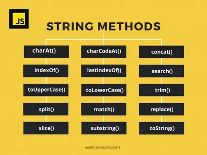

# Методы в JS

### В JavaScript любые текстовые данные являются строками. Не существует отдельного типа «символ», который есть в ряде других языков.
### В JavaScript есть разные типы кавычек.
### Строку можно создать с помощью одинарных, двойных либо обратных кавычек
### Одинарные и двойные кавычки работают, по сути, одинаково, а если использовать обратные кавычки, то в такую строку мы сможем вставлять произвольные выражения, обернув их в ${…}:
### Ещё одно преимущество обратных кавычек — они могут занимать более одной строки, вот так:
let guestList = `Guests:
 * John
 * Pete
 * Mary
`;

alert(guestList); // список гостей, состоящий из нескольких строк
### Выглядит вполне естественно, не правда ли? Что тут такого? Но если попытаться использовать точно так же одинарные или двойные кавычки, то будет ошибка:
### Одинарные и двойные кавычки в языке с незапамятных времён: тогда потребность в многострочных строках не учитывалась. Что касается обратных кавычек, они появились существенно позже, и поэтому они гибче.
### Обратные кавычки также позволяют задавать «шаблонную функцию» перед первой обратной кавычкой. Используемый синтаксис: func`string`. Автоматически вызываемая функция func получает строку и встроенные в неё выражения и может их обработать. Подробнее об этом можно прочитать в документации. Если перед строкой есть выражение, то шаблонная строка называется «теговым шаблоном». Это позволяет использовать свою шаблонизацию для строк, но на практике теговые шаблоны применяются редко.
# Свойство length содержит длину строки:
# Доступ к символам
### Получить символ, который занимает позицию pos, можно с помощью квадратных скобок: [ ]. Также можно использовать метод str.at(). Первый символ занимает нулевую позицию:
### Содержимое строки в JavaScript нельзя изменить. Нельзя взять символ посередине и заменить его. Как только строка создана — она такая навсегда.
### Методы toLowerCase() и toUpperCase() меняют регистр символов:
### метод — str.indexOf(substr, pos).
### Он ищет подстроку substr в строке str, начиная с позиции pos, и возвращает позицию, на которой располагается совпадение, либо -1 при отсутствии совпадений.
### Метод `concat(...strings)` объединяет две или более строки в одну, возвращая новую строку.
### Метод `replaceAll(searchValue, newValue)` заменяет все вхождения указанного значения на новое значение.
### Метод `repeat(count)` создает и возвращает новую строку, которая состоит из указанного количества повторений исходной строки.
### Метод `split(separator)` разбивает строку на массив подстрок по указанному разделителю.
### Метод `trim()` удаляет пробелы в начале и в конце строки.
